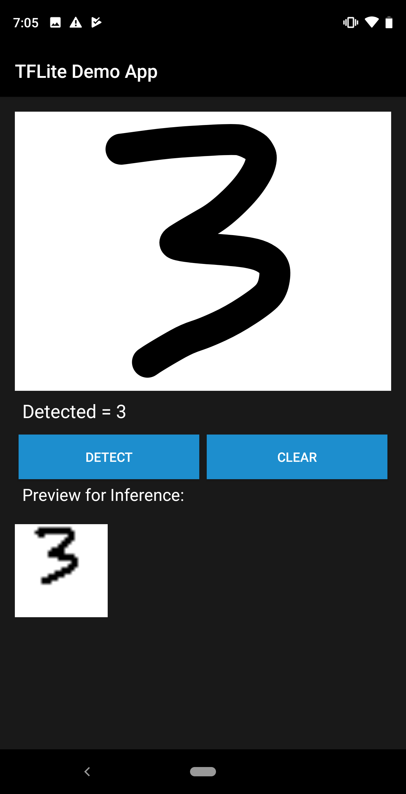

# Handwriting Detector App

This simple app uses a model trained on the MNIST dataset to detect handwritten numbers between 0 and 9.

## Fritz AI
Fritz AI helps you teach your applications how to see, hear, feel, think, and sense. Create ML-powered features in your mobile apps for both Android and iOS. Start with our ready-to-use feature APIs or connect and deploy your own custom models.

[Sign up](https://app.fritz.ai/register) for an account on Fritz AI in order to get started with machine learning in your apps.

## Join the community
[Heartbeat](https://heartbeat.fritz.ai/?utm_source=github&utm_campaign=fritz-models) is a community of developers interested in the intersection of mobile and machine learning. [Chat with us in Slack](https://join.slack.com/t/heartbeat-by-fritz/shared_invite/enQtMzY5OTM1MzgyODIzLTZhNTFjYmRiODU0NjZjNjJlOGRjYzI2OTIwY2M4YTBiNjM1ODU1ZmU3Y2Q2MmMzMmI2ZTIzZjQ1ZWI3NzBkZGU) and stay up to date on the latest mobile ML news with our [Newsletter](https://www.fritz.ai/newsletter).

## Help
For any questions or issues, you can:
- Submit an issue on this repo
- Go to our [Help Center](https://docs.fritz.ai/help-center/index.html)
- Message us directly in [Slack](https://heartbeat-by-fritz.slack.com/join/shared_invite/enQtNTY5NDM2MTQwMTgwLTAyODE3MmQzZjU2NWE5MDNmYTgwM2E1MjU5Y2Y2NmI2YTlkMTMwZTAwYTAwMzQ5NzQ2NDBhZjhmYjU2YWY3OGU)
